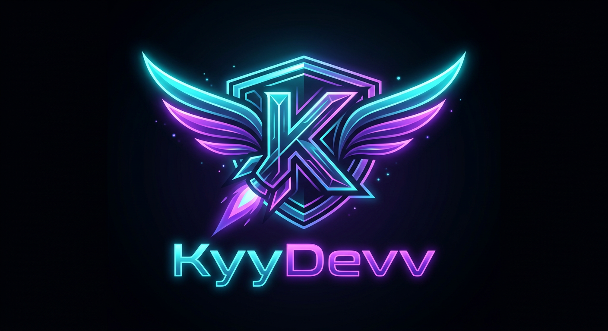

# 🚀 KyyDevv — Zip2Repo & One-Click Multi-Cloud Deployer

> **SUPER KEREN**, modern, full animasi mewah, dark mode cyber aesthetic, client-side ZIP extractor, real-time terminal build log, dan **One-Click Deployer** ke Vercel, Netlify, Railway, Cloudflare Pages, & Render!



---

## ✨ Fitur Utama (Features)

1. **🔐 GitHub PAT Management**:
   - User memasukkan GitHub Personal Access Token (PAT) sekali saja.
   - Token disimpan aman di `localStorage` (persisten saat refresh / buka ulang).
   - Validasi otomatis ke API GitHub `/user` menampilkan Username, Avatar, & Status.

2. **⚙️ Panel Settings (Slide-in Drawer)**:
   - Status koneksi PAT (`Connected` vs `Not Set`).
   - Ubah token / Hapus token kapan saja.
   - Toggle Efek Suara (Web Audio SFX) & Animasi Particle.
   - Riwayat deployment terakhir (Recent Deployments).

3. **📦 Multi-Mode Repository Workflows**:
   - **Mode 1**: Buat Repository Baru + Push File ZIP.
   - **Mode 2**: Push ke Repository Existing.
   - **Mode 3**: Hapus Repository (Konfirmasi ganda dengan mengetikkan nama repo).
   - Upload file `.zip` (hingga 50MB) dengan Drag & Drop.

4. **⚡ Browser Unpack & Git Data API**:
   - Ekstraksi `.zip` langsung di browser menggunakan `JSZip` (tidak membebani server).
   - Otomatis membuat `README.md` jika tidak ada di dalam ZIP.
   - Push file per file via **Git Data API** (`blob` → `tree` → `commit` → `ref`).

5. **💻 Real-Time Terminal Build Log**:
   - Terminal CI/CD ala hacker dengan efek scanline retro, kursor berkedip, timestamp `[14:20:05]`.
   - Real-time progress bar dan status text dinamis per-file.

6. **🚀 EPIC Success Page**:
   - Animasi roket meluncur full-screen & ledakan confetti.
   - Link repo GitHub dengan 1-Click Copy & Open.
   - **Tombol One-Click Deploy Grid**:
     - 🚀 Deploy to Vercel
     - 🟢 Deploy to Netlify
     - 🟣 Deploy to Railway
     - ☁️ Deploy to Cloudflare Pages
     - 📦 Deploy to Render

7. **🎨 Styling & Animation**:
   - Tailwind CSS + Framer Motion.
   - Custom 3D Tilt Cards, Cursor Glow Spotlight, Floating Gradient Blobs, Web Audio API Sound Effects.

---

## 🛠️ Tech Stack & Setup

- **Frontend**: React 18 + Vite + Tailwind CSS + Framer Motion
- **Backend**: Node.js + Express (`server.mjs`)
- **Unzip**: JSZip (client-side)
- **GitHub**: @octokit/rest + Git Data API
- **Deployment**: Railway / Render / Node server

### Run Locally

```bash
# 1. Install dependencies
npm install --legacy-peer-deps

# 2. Build frontend assets
npm run build

# 3. Start Express server
npm start
```

Server berjalan di `http://localhost:5000`.

---

## 🚂 Cara Deploy ke Railway (Railway-Ready)

1. Push repository ini ke akun GitHub Anda.
2. Buka [Railway.app](https://railway.app) lalu klik **New Project** → **Deploy from GitHub repo**.
3. Pilih repository ini. Railway akan secara otomatis mendeteksi `Dockerfile` / `package.json` dan menjalankan `npm run build` lalu `npm start`.
4. Aplikasi KyyDevv siap digunakan! ⚡

---

*Crafted with 💜 by **KyyDevv**.*
